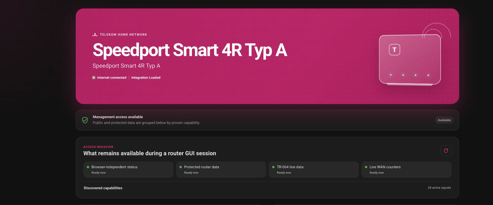
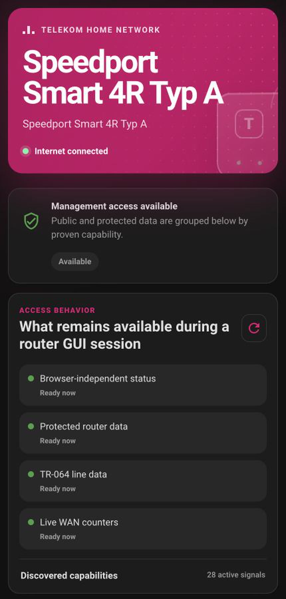

# Telekom Speedport Smart

Telekom Speedport Smart is a local, capability-driven Home Assistant custom
integration for Telekom Speedport routers. It combines the router's encrypted
local JSON API with its local ToTR64 service to provide live WAN traffic,
connection data, router services, supported controls, and a responsive
Home Assistant dashboard without a cloud account.

The integration domain is **speedport_smart**. The public integration name is
**Telekom Speedport Smart**.

> [!IMPORTANT]
> This repository is prepared for installation as a HACS custom repository and
> for submission to the HACS default catalog. It must not be described as
> officially listed until the HACS submission has been accepted.

## Highlights

- Local polling only; router data is not sent to an integration cloud
- Aggregate WAN bytes received/sent and derived live download/upload rates
- Active WAN-interface discovery instead of a fixed interface index
- Internet, DSL, Hybrid/mobile, Wi-Fi, Mesh, client, LAN, telephony, system,
  security, VPN, USB, and diagnostic entities when the router exposes them
- Capability-driven entity creation across different models and firmware
- Explicit management-session status and read-only recovery
- Bundled, responsive Home Assistant sidebar dashboard
- Home Assistant sensors, binary sensors, device trackers, switches, buttons,
  and firmware update entities
- Privacy-redacted diagnostics
- Configurable fast, normal, and slow polling groups

## Dashboard preview

The bundled dashboard follows Home Assistant's dark theme and adapts to both
desktop and mobile layouts. These captures contain only the router model and
generic availability states; network and household identifiers are excluded.

### Desktop

### Mobile

## Compatibility

The current integration code has been validated with read-only requests against:

- **Router:** Speedport Smart 4R Typ A
- **Firmware:** 010152.5.0.001.0
- **Home Assistant:** 2025.12.0 or newer
- **Language:** English

Other Speedport models or firmware may expose a different set of endpoints and
entities. An entity appears only when both the integration implements it and
the connected router supplies evidence for that capability. Missing
firmware-specific features are omitted; a temporarily failed supported entity
remains registered and becomes unavailable until fresh data succeeds.

Home Assistant must be able to reach the router on the local network. The
router password is required during setup. HACS is optional when installing
manually.

## Installation

### HACS custom repository

Until the integration is accepted into the HACS default catalog:

1. In HACS, open the three-dot menu and select **Custom repositories**.
2. Add
   **https://github.com/aarikmudgal/ha-speedport-smart** as an
   **Integration** repository.
3. Find **Telekom Speedport Smart** in HACS and install the latest stable
   version.
4. Restart Home Assistant.
5. Open **Settings > Devices & services > Add integration**.
6. Select **Telekom Speedport Smart**.

After default-catalog acceptance, the custom-repository step is no longer
needed and the integration can be found directly in HACS.

### Manual stable release

1. Download **speedport_smart.zip** from the desired full GitHub release.
2. Extract its contents to
   **/config/custom_components/speedport_smart**.
3. Confirm that
   **/config/custom_components/speedport_smart/manifest.json** exists.
4. Restart Home Assistant.
5. Add **Telekom Speedport Smart** from **Settings > Devices & services**.

Do not install GitHub's automatically generated source archive as the HACS
package. Use the attached **speedport_smart.zip** release asset.

### Beta releases

Beta builds are created from branches matching <code>feat/*</code>, for example
**feat/live-bandwidth**, and use versions such as
**X.Y.Z-beta.RUN.ATTEMPT**. They may be less stable than a release from
**main**.

To receive them through HACS, enable the disabled HACS switch entity for this
repository, then turn that prerelease switch on. With the switch off, HACS
tracks only stable releases. Return to a stable release by turning the switch
off and selecting the latest stable version in HACS.

## Setup

Before initial setup, use **Logout** in every open Speedport web interface.
Closing a browser tab alone can leave its router management lease active.
Disable any other Home Assistant integration or local polling tool connected
to the same Speedport; competing clients can contend for its single protected
management lease.

Enter:

- **Host:** router hostname or IP address; **speedport.ip** is the default
- **Router password:** the device password used by the Speedport web interface
- **Use HTTPS:** normally off unless HTTPS is configured and reachable
- **Verify TLS certificate:** enable only when Home Assistant trusts the
  router certificate

Many Speedport routers use a self-signed certificate. A normal local setup
therefore commonly uses HTTP, or HTTPS with certificate verification disabled.
The password is stored in the Home Assistant config entry; never place it in
YAML, logs, diagnostics, terminal history, or an issue report.

## Built-in Home Assistant dashboard

Installation adds **Telekom Speedport Smart** to the Home Assistant sidebar.
This is a native Home Assistant custom panel bundled with the integration, not
a separate website or Lovelace card. No additional frontend repository is
required.

The panel:

- follows the active Home Assistant light or dark theme
- adapts to desktop and mobile layouts
- groups data hierarchically by connection, bandwidth, DSL, mobile, Wi-Fi,
  clients, telephony, router services, management, and controls
- groups child-device entities into individual device cards
- uses live Home Assistant entity states; router names and values are not
  hardcoded
- respects the signed-in user's entity permissions
- asks for confirmation before executing a router-changing action

All entities remain available through the standard **Devices & services**
pages for dashboards, automations, history, and statistics. Disabling an entity
in Home Assistant also removes it from the bundled panel.

## Data and polling

One serialized client owns encrypted JSON authentication, ToTR64 SOAP, and the
router management lease so polling groups do not compete with each other.

| Group | Default | Allowed | Typical data |
| --- | ---: | ---: | --- |
| Fast | 5 seconds | 1–60 seconds | WAN counters, rates, utilization, live connection state |
| Normal | 30 seconds | 15–300 seconds | Wi-Fi, clients, telephony, operational status |
| Slow | 5 minutes | 1–60 minutes | Configuration, topology, firmware, slow-changing services |

Change these values from **Settings > Devices & services > Telekom Speedport
Smart > Configure**. One-second fast polling is best-effort; five seconds is
recommended for router reliability and usually matches the router's own counter
refresh cadence.

The router supplies cumulative byte counters. The integration calculates live
rates from counter changes over monotonic time and rejects negative values,
reboot resets, and false reset spikes. Totals use Home Assistant's
total-increasing statistics model, allowing Home Assistant to select a readable
unit and retain long-term statistics. Use Home Assistant's Utility Meter
integration for daily, weekly, monthly, or yearly consumption.

Live rate is aggregate WAN traffic, not packet capture and not per-client
throughput. On validated Hybrid firmware, the active BONDING/habond interface
already represents combined traffic, so LTE tunnel counters are not added a
second time.

## Router management access

Protected Speedport endpoints may permit only one active management owner. The
diagnostic **Management access** entity reports whether protected data is
available, blocked by another session, locked by a cooldown, recovering, or
unknown. When supplied by the router, its attributes include the competing
owner's IP address, browser logout guidance, retry delay, and last successful
protected update.

If the web interface owns the lease:

1. Select **Logout** in the router web interface.
2. Return to Home Assistant.
3. Press **Retry protected data (log out of the router first)** or complete the
   Home Assistant Repair flow.

The retry performs read-only discovery. It does not change router settings or
force another session to disconnect. Public data that the firmware exposes
without a protected lease can continue updating while protected entities are
temporarily unavailable. Restarting the router should not be a routine
recovery step.

## Router controls

Controls are shown only when the router reports a matching capability and the
integration has a specific implementation for that command. Supported controls
are enabled by default so users can access their router's full confirmed
capability set. They remain idle during setup, polling, discovery, retry,
reload, and diagnostics.

The bundled dashboard asks for confirmation before an action. Invoking the same
button, switch, update, service, script, or automation elsewhere in Home
Assistant follows normal Home Assistant behavior, so review automations
carefully. Controls can be hidden completely from the integration options.

Router-changing commands were not executed during read-only development
validation. Review and test each action on your own router. The integration
does not expose factory reset, configuration restore, credential changes, SIM
PIN/PUK operations, secret export, firewall disable, arbitrary SOAP execution,
or destructive device deletion.

## Diagnostics and privacy

Download diagnostics from the integration's device page before opening a
support issue. The diagnostics layer redacts credentials, public addresses,
phone numbers, MAC addresses, SIM identifiers, VPN secrets, and raw router
payloads. Review the file yourself before sharing it.

Never publish raw router responses. Firmware pages can contain passwords,
telephone data, public IP addresses, client identifiers, and other private
material. See [Security](SECURITY.md) for private vulnerability reporting.

## Upgrading and removal

For a HACS installation, install the desired update in HACS and restart Home
Assistant when prompted. Read release notes before moving between stable and
beta channels.

For a manual installation, replace the complete
**/config/custom_components/speedport_smart** directory with the contents of
one release asset, then restart Home Assistant. Do not mix files from two
versions.

To remove the integration:

1. Delete its config entry from **Settings > Devices & services**.
2. Remove **Telekom Speedport Smart** from HACS, or delete the manual component
   directory.
3. Restart Home Assistant.

Home Assistant may retain entity history and long-term statistics according to
its recorder settings.

## Support and development

- Start with [Support and troubleshooting](SUPPORT.md).
- Report reproducible bugs through
  [GitHub Issues](https://github.com/aarikmudgal/ha-speedport-smart/issues).
- Read [Contributing](CONTRIBUTING.md) before submitting changes.
- Read [Release process](docs/RELEASING.md) for stable and beta channels.
- Maintainers can use the [HACS submission checklist](docs/HACS_SUBMISSION.md).
- Protocol and lifecycle design is documented in
  [Architecture](ARCHITECTURE.md).
- Changes are recorded in [Changelog](CHANGELOG.md).

## License and trademark notice

This project is licensed under the [MIT License](LICENSE).

This is an independent, unofficial community integration. It is not affiliated
with, endorsed by, or supported by Deutsche Telekom AG. Telekom, Speedport, and
related marks are the property of their respective owners and are used only to
identify compatible products.
